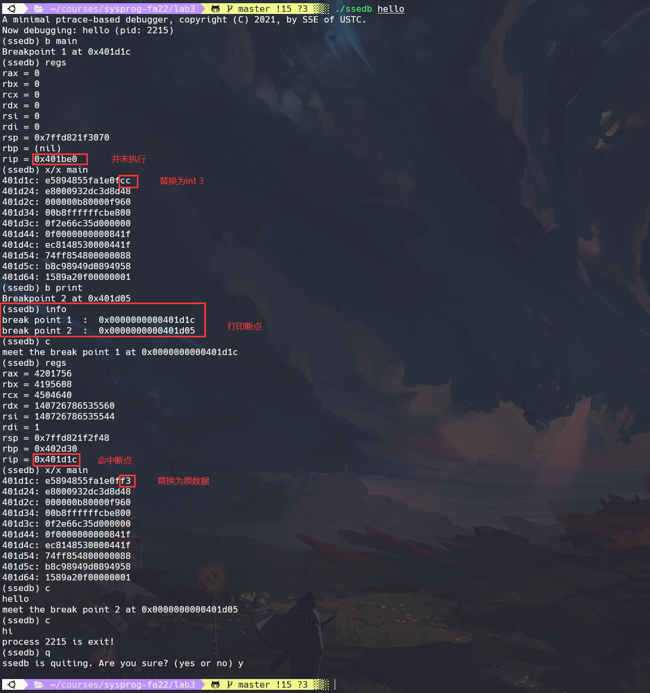
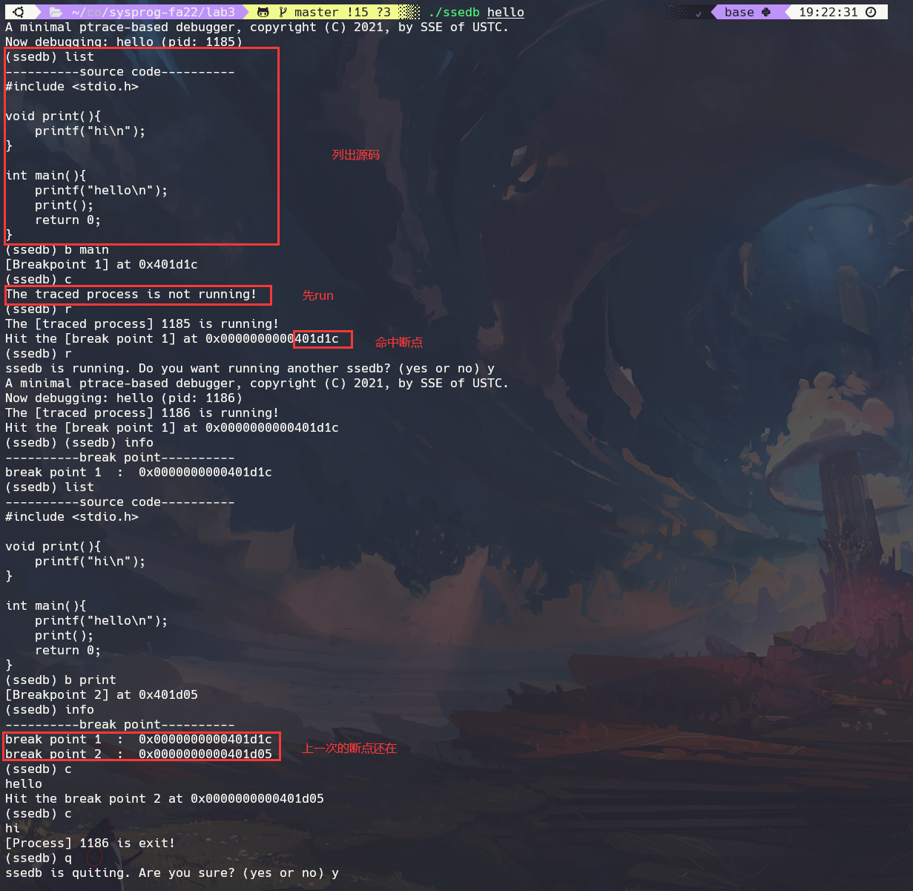

# lab3 ：A Minimal Debugger

## Exercise 1:

Now read the source file and answer the following questions.

- How the `regs` command is implemented?

### Solution

+ 定义`user_regs_struct`类型变量`regs`接收寄存器组
+ 调用`ptrace (PTRACE_GETREGS, c->pid, 0, &regs)`将寄存器的值写入`regs`

+ 打印各寄存器的值

## Exercise 2:

Now, how the breaking point command `b 0xaddr` is implemented? In fact, there is a serious bug in current implementation we offered you. Let's check where is this bug. First run this

```bash
objdump -d hello
```

and figure out the address of the function `print`, suppose that address is `0xaddr` on your machine. Now in the `ssedb`, you set up a break point on address `0xaddr` by typing (remember this address must be in hexadecimal, which has a leading `0x`):

```bash
(ssedb) b 0xaddr
```

now peek the registers:

```
(ssedb) regs
```

What's the value of `rip`? Is this value right? Why?

And then disassembly the content at address `0xaddr`.

```
(ssedb) x/x 0xaddr
```

What's there? Have you detected the bug? How to fix this bug?

### Solution

1. `rip`的值需要从两方面讨论，因为`rip`存储的是下一条指令的地址，设置断点时，将第一个字节设置为`0xcc`即`int 3`软中断指令，当子进程执行到此处时，会停止且发送信号给父进程，由于已经执行了`int 3` 那么其实`rip`的值是正确的，因为它确实指向了`int 3`的下一条指令的地址，但是，这种情况却不是我们想要的，因为我们为了让子进程停在断点处，于是覆盖了第一个字节，那么第一个字节的指令并未执行，所以在父进程中我们就需要恢复断点信息(因为第一个字节的指令并未执行)，即

   + `rip = rip - 1`
   + 将`0xcc`改为原来的值

   ```c
   case CMD_KIND_BREAK:{
       unsigned long brk = 0x00000000000000cc;
       unsigned long data;
       unsigned long back;     // copy the origin data
   
       data = ptrace(PTRACE_PEEKDATA, c->pid, c->u.addr, 0);
       back = data;
       printf ("init data     = %lx\n", data);
       data = (data & 0xffffffffffffff00) | brk;
       printf ("revised data  = %lx\n", data);
       ptrace(PTRACE_POKEDATA, c->pid, c->u.addr, data);
       // child will stop in (int 3)
       ptrace(PTRACE_CONT, c->pid, 0, 0);
       waitChild ();
   
       // write back the origin rip
       struct user_regs_struct regs;
       ptrace (PTRACE_GETREGS, c->pid, 0, &regs);
       regs.rip--;
       ptrace (PTRACE_SETREGS, c->pid, 0, &regs);
       // write back the origin data
       ptrace(PTRACE_POKEDATA, c->pid, c->u.addr, back);
   
       return;
   }
   ```

2. 没有显示前导0，只需在打印时指定正确的格式即可，即`printf ("%lx: %016lx\n", addr, data)`

   

可以看到最低字节又修改为原来的值了

### Improvement

由于所给代码在`b addr`后会接着执行一条`ptrace(PTRACE_CONT, c->pid, 0, 0);`，这会导致`traced`程序直接命中断点，故将`CONT`指令移除，只设置断点，即写入一条`int 3`指令，并将原数据保存起来，定义`struct breakpoint`

```c
struct breakpoint{
    long addr;
    unsigned long origin;
};
```

存放其地址和原始数据，而真正命中断点后还原断点信息的代码放在`case CMD_KIND_CONT`

```c
case CMD_KIND_CONT:{
    ptrace(PTRACE_CONT, c->pid, 0, 0);
    int status;
    wait (&status);

    // back to origin rip
    struct user_regs_struct regs;
    ptrace (PTRACE_GETREGS, c->pid, 0, &regs);
    unsigned long long rip = regs.rip - 1;
    unsigned long data = ptrace(PTRACE_PEEKDATA, c->pid, rip, 0);
    if((uint8_t)data == 0xcc) {      // meet break point
        regs.rip--;
        ptrace(PTRACE_SETREGS, c->pid, 0, &regs);
        // write back the origin data
        unsigned long origin = get_origin();
        ptrace(PTRACE_POKEDATA, c->pid, rip, origin);
        printf("meet the break point %d at 0x%016x\n", idx, rip);
    }
    if(WIFEXITED(status))	// exit ?
        printf("process %d is exit!\n", c->pid);
    return;
}
```

这样做的结果是，`b addr`只设置断点，不会让`traced`程序继续运行，而`c`可以`traced`程序运行，并且可以命中断点，由于已经有了断点信息，索性增加了一个新的指令`info`：打印所有`break point`，实现如下：

```c
int len = 0;	// 断点个数
int idx = 0;	// 命中个数

struct breakpoint bp[100];

void update_breakpoint_table(char *name, long addr, unsigned long origin){
    bp[len].name = name;
    bp[len].addr = addr;
    bp[len].origin = origin;
    len++;
}
```

在`execCommand`中新增`case`

```c
case CMD_KIND_INFO:{
    for(int i = 0; i < len; i++)
        printf("break point %d  :  0x%016x\n", i + 1, bp[i].addr);
    return ;
}
```

最终执行的效果:



### GDB like

为了靠近`gdb`的设计，将`run`命令修改，且`continue`不得在`run`前执行，并且支持调试时重启一个新的`ssedb`，加入`list`输出源码功能，具体细节可参见源代码



## Exercise 3:

There is also a command to disassembly bianry into assembly intructions, but has not be completed. Now run

```
(ssedb) x/i 0xaddr 
```

you'll see an error message indicating the file position you should supply code. Implement it. (Hint: manual disassemblying is tedious and error-prone, so you may find some libraries are helpful, such as the [zydis](https://github.com/zyantific/zydis).)

### Solution

使用第三方库`zydis`，指令在我的机器上按`little endian`存储，故需要将获得的8字节16进制数据逆序且两两一组存放

```c
ZyanU8 arr[80];  // define byte arr
long addr = c->u.addr;
for (int i = 0; i < 10; i++){
	long data = ptrace(PTRACE_PEEKDATA, c->pid, addr, 0);
	for(int j = 0; j < 8; j++){
		arr[8 * i + j] = data & 0x00000000000000ff;
		data = ((data & 0xffffffffffffff00) >> 8);
	}
	addr += 8;
}
```

这样机器码会按地址的从小到大存放在`arr`中，便于反汇编成汇编代码，然后交给`zydis`解析即可

```c
ZyanU64 runtime_address = c->u.addr;

// Loop over the instructions in our buffer.
ZyanUSize offset = 0;
ZydisDisassembledInstruction instruction;

while (ZYAN_SUCCESS(ZydisDisassembleIntel(
	/* machine_mode:    */ ZYDIS_MACHINE_MODE_LONG_64,
	/* runtime_address: */ runtime_address,
	/* buffer:          */ arr + offset,
	/* length:          */ sizeof(arr) - offset,
	/* instruction:     */ &instruction
))) {
	printf("%016" PRIX64 "  %s\n", runtime_address, instruction.text);
	offset += instruction.info.length;
	runtime_address += instruction.info.length;
}
```


##  Challenge:

Another feature missing from the `ssedb` is debugging symbols. For instance, when setting up breaking points, we'd like just to type a symbolic name, such as:

```
(ssedb) b main   
```

instead of an ugly hexadecimal address for `main`. Implement this feature.

### Solution

调用BFD库，BFD库可以将符号和对应的值(地址)保存起来，这样如果输入一个符号，只需查询其地址即可

```c
asymbol **symbol_table;	// symbol table
long num_symbols;		// length

// store symbol's name and value
void bfd_func(char *file){
    long storage_needed;
    bfd *abfd;

    bfd_init(); // magic

    abfd = bfd_openr(file, NULL);
    assert(abfd != NULL);
    bfd_check_format(abfd, bfd_object);
    storage_needed = bfd_get_symtab_upper_bound(abfd);
    assert(storage_needed >= 0);

    symbol_table = (asymbol**)malloc(storage_needed);
    assert(symbol_table != 0);
    num_symbols = bfd_canonicalize_symtab(abfd, symbol_table);
    assert(num_symbols >= 0);
}

// find symbol address
long symbol_address(char *s){
    symbol_info symbolinfo;
    for(int i = 0; i < num_symbols; i++){
        if (symbol_table[i]->section == NULL) continue;

        bfd_symbol_info(symbol_table[i], &symbolinfo);
        if (strcmp(s, symbolinfo.name))  continue;

        printf("%s : 0x%x\n", symbolinfo.name, symbolinfo.value);
        return (long)symbolinfo.value;
    }
}
```

在`main.c`中调用`bfd_func()`获得符号表，然后在`parseCommand`中判断输入是地址还是符号，如果是符号，则调用`symbol_address()`函数查找地址，顺便也实现了`x/i symbol` 和 `x/x symbol`


## 小结

本次实验整体不难，代码很全，难点是第三方库加入到工程中，需要一些`cmake`的知识。一开始将`exercese2`想的很简单，以为就前导0一个问题，不知道为什么要将第一个字节替换为`0xcc`，直到实现了`x/i`才知道，原来是需要一条`int 3`指令，使得子进程停止，那么问题就变得有意思了，再次返回父进程后我们需要将断点的原始信息还原。